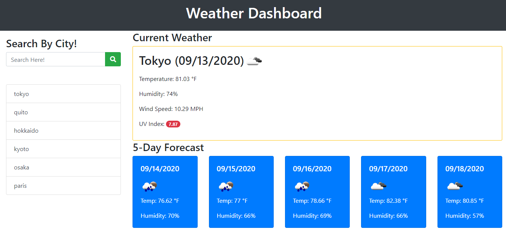

# Weather Dashboard :sun_behind_small_cloud: :cloud_with_lightning_and_rain: :fire: :cloud_with_snow: 	:tornado: :fog: :cyclone: :umbrella:
## Forecasts and Current Weather for your most frequently visited cities!

Here is a direct and working URL to weather dashboard!

[Click here for the weather dashboard!](https://cat-lin-morgan.github.io/weather-dashboard/ "Cat's Weather Dashboard")

## Acceptance Criteria
When you load the page you are presented with a form input. 

When you search for a city you are presented with current and future weather conditions.

They are added to the local storage so when you refresh the page they will still be there.

When you view the current weather you are presented with the city's name, an icon representing the weather condition, the temperature, the humidity, the wind speed, and a UV Index that changes color according to severity. :skull_and_crossbones:

When you view the five day forecast you get the date, an icon representing the respective weather conditions, temperature, and humidity. :sweat_drops:

When you click on the city history, you get the city's current and future weather conditions! :volcano: :mountain_snow:

Below is a gif of the __weather dashboard__ in action and below that is the screenshot.

---

*Thank you for viewing.*